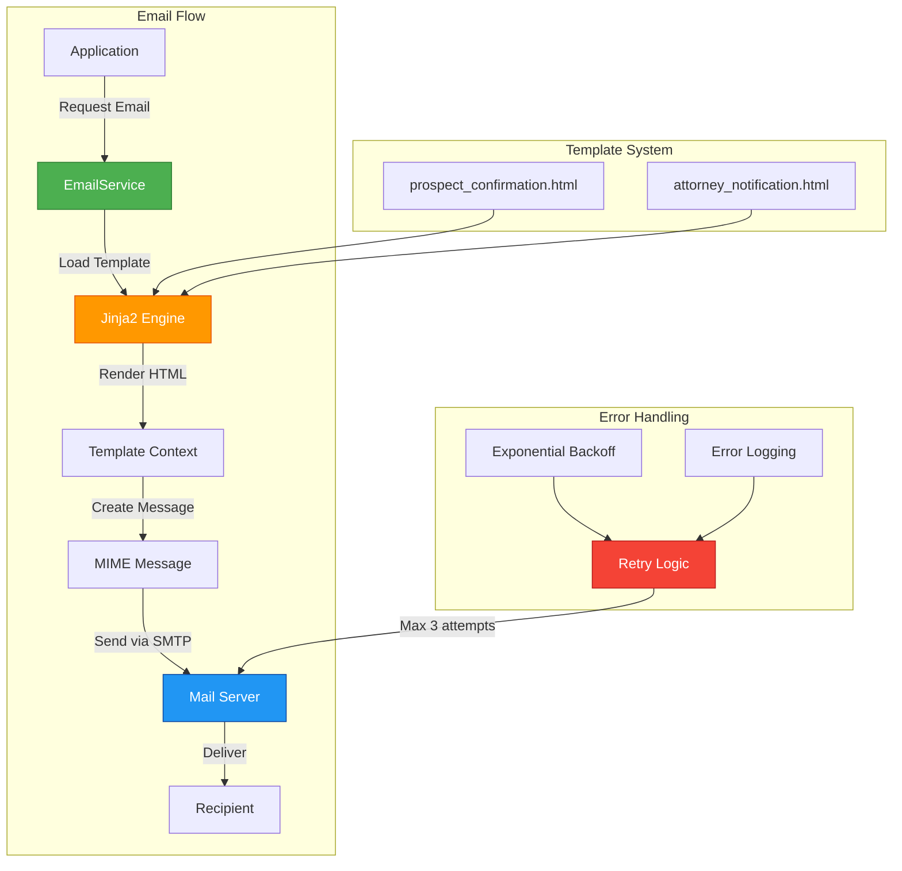

# Email Service Documentation

## Overview

The `EmailService` provides email notification functionality for the lead management system. It handles sending HTML emails to prospects and attorneys using SMTP with template rendering via Jinja2, automatic retry logic, and comprehensive error handling.

## Architecture



## EmailService Class

### Initialization

```python
from app.services.email_service import EmailService

# Service automatically initializes with settings and template engine
service = EmailService()
```

The service:
- Loads SMTP configuration from `Settings`
- Initializes Jinja2 template engine
- Sets up template directory path

### Configuration

From `app.core.config.Settings`:

```python
SMTP_HOST: str              # SMTP server hostname
SMTP_PORT: int = 587        # SMTP port (default: 587 for TLS)
SMTP_USERNAME: str          # SMTP authentication username
SMTP_PASSWORD: str          # SMTP authentication password
SMTP_FROM_EMAIL: EmailStr   # Sender email address
SMTP_FROM_NAME: str         # Sender display name
ATTORNEY_EMAIL: EmailStr    # Attorney recipient email
```

## Methods

### 1. send_prospect_confirmation()

Sends a confirmation email to a prospect after lead submission.

**Signature:**
```python
async def send_prospect_confirmation(
    self,
    prospect_email: str,
    prospect_name: str,
    lead_id: str
) -> bool
```

**Parameters:**
- `prospect_email`: Prospect's email address
- `prospect_name`: Prospect's full name
- `lead_id`: UUID of the created lead

**Returns:**
- `bool`: `True` if email sent successfully

**Raises:**
- `HTTPException(500)`: Template rendering failed
- `HTTPException(500)`: Email sending failed after retries

**Example:**
```python
from app.services.email_service import EmailService

email_service = EmailService()

await email_service.send_prospect_confirmation(
    prospect_email="john.doe@example.com",
    prospect_name="John Doe",
    lead_id="a1b2c3d4-e5f6-7890-abcd-ef1234567890"
)
```

**Email Contents:**
- Professional HTML template
- Submission confirmation
- Reference number (lead ID)
- Next steps information
- Timeline expectations

### 2. send_attorney_notification()

Sends a notification email to the attorney about a new lead submission.

**Signature:**
```python
async def send_attorney_notification(
    self,
    lead_id: str,
    prospect_name: str,
    prospect_email: str,
    resume_filename: str,
    dashboard_url: Optional[str] = None
) -> bool
```

**Parameters:**
- `lead_id`: UUID of the created lead
- `prospect_name`: Prospect's full name
- `prospect_email`: Prospect's email address
- `resume_filename`: Name of uploaded resume file
- `dashboard_url`: Optional URL to lead in dashboard (defaults to `/leads/{lead_id}`)

**Returns:**
- `bool`: `True` if email sent successfully

**Raises:**
- `HTTPException(500)`: Template rendering failed
- `HTTPException(500)`: Email sending failed after retries

**Example:**
```python
await email_service.send_attorney_notification(
    lead_id="a1b2c3d4-e5f6-7890-abcd-ef1234567890",
    prospect_name="John Doe",
    prospect_email="john.doe@example.com",
    resume_filename="a1b2c3d4-..._resume.pdf",
    dashboard_url="https://dashboard.example.com/leads/a1b2c3d4-..."
)
```

**Email Contents:**
- Alert badge for new lead
- Lead details summary
- Direct link to dashboard
- Action required notice
- Lead status (PENDING)

### 3. send_custom_email()

Sends a custom HTML email with specified content.

**Signature:**
```python
async def send_custom_email(
    self,
    to_email: str,
    subject: str,
    html_content: str,
    max_retries: int = 3
) -> bool
```

**Parameters:**
- `to_email`: Recipient email address
- `subject`: Email subject line
- `html_content`: HTML content of the email
- `max_retries`: Maximum retry attempts (default: 3)

**Returns:**
- `bool`: `True` if email sent successfully

**Raises:**
- `HTTPException(500)`: Email sending failed after retries

**Example:**
```python
html = """
<html>
<body>
    <h1>Custom Email</h1>
    <p>This is a custom message.</p>
</body>
</html>
"""

await email_service.send_custom_email(
    to_email="recipient@example.com",
    subject="Custom Notification",
    html_content=html,
    max_retries=5
)
```

## Email Templates

### Template Location

Templates are stored in `app/templates/`:
```
app/
└── templates/
    ├── prospect_confirmation.html
    └── attorney_notification.html
```

### Prospect Confirmation Template

**File:** `prospect_confirmation.html`

**Variables:**
- `{{ prospect_name }}` - Recipient's full name
- `{{ lead_id }}` - Lead reference ID
- `{{ company_name }}` - Company name from settings

**Features:**
- Professional styling
- Responsive design
- Clear submission confirmation
- Reference number display
- Next steps section
- Timeline expectations
- Professional signature

**Preview:**
```html
✓ Submission Received

Dear John Doe,

Thank you for submitting your information to Lead Management System.
We have successfully received your application...

Your submission reference: a1b2c3d4-e5f6-7890-abcd-ef1234567890

What Happens Next?
• Review: An attorney will review your information
• Contact: We'll reach out within 3-5 business days
• Next Steps: Discuss opportunities and answer questions
```

### Attorney Notification Template

**File:** `attorney_notification.html`

**Variables:**
- `{{ lead_id }}` - Lead UUID
- `{{ prospect_name }}` - Prospect's full name
- `{{ prospect_email }}` - Prospect's email address
- `{{ resume_filename }}` - Uploaded resume filename
- `{{ dashboard_url }}` - Link to lead in dashboard

**Features:**
- Attention-grabbing design
- "NEW LEAD" badge
- Structured lead details
- Action button to dashboard
- Status indicator
- Action required notice

**Preview:**
```html
[NEW LEAD]
🔔 Lead Submission Alert

Lead Details:
Name:     John Doe
Email:    john@example.com
Resume:   resume.pdf
Lead ID:  a1b2c3d4-...
Status:   PENDING

[View Lead in Dashboard →]

⏱️ Action Required:
Please review this lead and reach out to the prospect.
```

## Features

### 1. Template Rendering

**Jinja2 Integration:**
- Automatic HTML escaping for security
- Variable substitution
- Template inheritance support
- Error handling with detailed messages

**Example:**
```python
# Internal method - used by send_* methods
html = service._render_template(
    "prospect_confirmation.html",
    {
        "prospect_name": "John Doe",
        "lead_id": "a1b2c3d4-...",
        "company_name": "Acme Corp"
    }
)
```

### 2. SMTP Connection

**Configuration:**
- TLS encryption via STARTTLS
- Username/password authentication
- Configurable host and port
- Connection pooling via async

**Connection Flow:**
1. Connect to SMTP server
2. Start TLS encryption
3. Authenticate with credentials
4. Send message
5. Close connection gracefully

### 3. Retry Logic

**Automatic Retries:**
- Default: 3 attempts
- Configurable per method
- Exponential backoff delay
- Detailed error messages

**Retry Behavior:**
```python
# Retry delays:
# Attempt 1: Immediate
# Attempt 2: 1 second delay
# Attempt 3: 2 second delay
# Attempt 4: 3 second delay (if max_retries=4)
```

**Example:**
```python
# Custom retry configuration
await service._send_email(
    message,
    max_retries=5,
    retry_delay=2.0  # 2 second base delay
)
```

### 4. Error Handling

**HTTP Exception Codes:**
- `500 Internal Server Error`: Template rendering failed
- `500 Internal Server Error`: Email sending failed after all retries

**Error Details:**
- Clear error messages
- Retry count information
- Original exception details
- Context for debugging

## Usage Patterns

### Basic Email Sending

```python
from fastapi import APIRouter, HTTPException
from app.services.email_service import EmailService

router = APIRouter()

@router.post("/notify-prospect")
async def notify_prospect(prospect_email: str, prospect_name: str, lead_id: str):
    email_service = EmailService()
    
    try:
        await email_service.send_prospect_confirmation(
            prospect_email=prospect_email,
            prospect_name=prospect_name,
            lead_id=lead_id
        )
        return {"message": "Email sent successfully"}
    except HTTPException as e:
        raise e
```

### Integrated Lead Creation

```python
from app.services.email_service import EmailService
from app.services.file_service import FileService
from app.db.repositories.lead_repository import LeadRepository

async def create_lead_with_notifications(
    lead_data: dict,
    resume: UploadFile,
    db: Session
):
    # Save resume
    file_service = FileService()
    resume_path = await file_service.save_file(resume)
    
    # Create lead
    lead_data["resume_path"] = resume_path
    lead_repo = LeadRepository(db)
    lead = lead_repo.create(lead_data)
    
    # Send notifications
    email_service = EmailService()
    
    # Notify prospect
    await email_service.send_prospect_confirmation(
        prospect_email=lead.email,
        prospect_name=f"{lead.first_name} {lead.last_name}",
        lead_id=str(lead.id)
    )
    
    # Notify attorney
    await email_service.send_attorney_notification(
        lead_id=str(lead.id),
        prospect_name=f"{lead.first_name} {lead.last_name}",
        prospect_email=lead.email,
        resume_filename=resume_path,
        dashboard_url=f"https://dashboard.example.com/leads/{lead.id}"
    )
    
    return lead
```

### Error Handling with Rollback

```python
from sqlalchemy.orm import Session

async def create_lead_safely(lead_data: dict, resume: UploadFile, db: Session):
    file_service = FileService()
    email_service = EmailService()
    lead_repo = LeadRepository(db)
    
    resume_path = None
    lead = None
    
    try:
        # Save resume
        resume_path = await file_service.save_file(resume)
        lead_data["resume_path"] = resume_path
        
        # Create lead
        lead = lead_repo.create(lead_data)
        db.commit()
        
        # Send emails
        await email_service.send_prospect_confirmation(
            prospect_email=lead.email,
            prospect_name=f"{lead.first_name} {lead.last_name}",
            lead_id=str(lead.id)
        )
        
        await email_service.send_attorney_notification(
            lead_id=str(lead.id),
            prospect_name=f"{lead.first_name} {lead.last_name}",
            prospect_email=lead.email,
            resume_filename=resume_path
        )
        
        return lead
        
    except Exception as e:
        # Rollback database changes
        db.rollback()
        
        # Clean up uploaded file
        if resume_path:
            file_service.delete_file(resume_path)
        
        raise HTTPException(
            status_code=500,
            detail=f"Failed to create lead: {str(e)}"
        )
```

## Test Coverage

### Test Suite (`tests/services/test_email_service.py`)

**19 comprehensive tests covering:**

1. **Initialization (1 test)**
   - Service setup
   - Template engine configuration

2. **Template System (4 tests)**
   - Template directory existence
   - Prospect template existence
   - Attorney template existence
   - Required field validation

3. **Template Rendering (3 tests)**
   - Prospect template rendering
   - Attorney template rendering
   - Missing template error handling

4. **Message Creation (2 tests)**
   - Default sender configuration
   - Custom sender configuration

5. **Email Sending (4 tests)**
   - Successful delivery
   - Retry logic on failure
   - All retries exhausted
   - SMTP connection handling

6. **High-Level Methods (5 tests)**
   - Prospect confirmation sending
   - Attorney notification sending
   - Attorney notification with dashboard URL
   - Custom email sending
   - Custom email with custom retries

### Running Tests

```bash
# Run email service tests only
pytest tests/services/test_email_service.py -v

# Run all service tests
pytest tests/services/ -v

# Run with coverage
pytest tests/services/test_email_service.py --cov=app.services.email_service
```

### Test Results

```
19 passed in 3.50s
✓ All template rendering validated
✓ All SMTP operations mocked and tested
✓ All retry logic validated
✓ All error cases handled
```

## Security Considerations

### 1. Credential Protection

**Never commit credentials:**
```bash
# .env file (never committed)
SMTP_HOST=smtp.example.com
SMTP_USERNAME=user@example.com
SMTP_PASSWORD=secret_password
SMTP_FROM_EMAIL=noreply@example.com
ATTORNEY_EMAIL=attorney@example.com
```

### 2. Template Security

**Auto-escaping enabled:**
```python
# Jinja2 auto-escapes HTML to prevent XSS
Environment(loader=FileSystemLoader(...), autoescape=True)
```

**Safe variable substitution:**
```html
<!-- Automatically escaped -->
<p>Hello {{ prospect_name }}</p>

<!-- If name contains <script>, it's escaped to &lt;script&gt; -->
```

### 3. Email Validation

**Pydantic validation:**
```python
# EmailStr ensures valid email format
SMTP_FROM_EMAIL: EmailStr
ATTORNEY_EMAIL: EmailStr
```

### 4. Rate Limiting

**Consider adding:**
- Rate limiting on email sending
- Queue-based email delivery
- Throttling for bulk operations

## Best Practices

### 1. Always Use Async

```python
# Good
await email_service.send_prospect_confirmation(...)

# Bad - will not work
email_service.send_prospect_confirmation(...)  # Missing await
```

### 2. Handle Exceptions Gracefully

```python
try:
    await email_service.send_prospect_confirmation(...)
except HTTPException as e:
    logger.error(f"Failed to send email: {e.detail}")
    # Don't let email failure prevent lead creation
    # Log and continue
```

### 3. Use Transaction Rollback

```python
# If email is critical, rollback database on failure
try:
    lead = lead_repo.create(lead_data)
    db.commit()
    await email_service.send_prospect_confirmation(...)
except:
    db.rollback()
    raise
```

### 4. Monitor Email Delivery

```python
# Log email sending for monitoring
import logging

logger = logging.getLogger(__name__)

try:
    result = await email_service.send_prospect_confirmation(...)
    logger.info(f"Sent confirmation to {prospect_email}")
except Exception as e:
    logger.error(f"Failed to send email: {str(e)}")
```

### 5. Test Email Templates Locally

```python
# Render templates without sending
from app.services.email_service import EmailService

service = EmailService()
html = service._render_template("prospect_confirmation.html", {
    "prospect_name": "Test User",
    "lead_id": "test-123",
    "company_name": "Test Company"
})

# Save to file for preview
with open("preview.html", "w") as f:
    f.write(html)
```

## Dependencies

- **aiosmtplib:** Async SMTP client
- **Jinja2:** Template rendering engine
- **email.mime:** MIME message creation
- **FastAPI:** HTTP exception handling
- **Pydantic:** Email validation

## Future Enhancements

1. **Advanced Features**
   - Email queue with background workers
   - Batch email sending
   - Email scheduling
   - Plain text alternative versions

2. **Template Improvements**
   - Template inheritance
   - Reusable components
   - Multi-language support
   - Dynamic styling

3. **Monitoring & Analytics**
   - Delivery tracking
   - Open/click tracking
   - Bounce handling
   - Email analytics dashboard

4. **Alternative Providers**
   - SendGrid integration
   - AWS SES support
   - Mailgun support
   - Provider failover

## Related Documentation

- [Configuration](./ENVIRONMENT_SETUP.md) - SMTP configuration
- [Authentication](./AUTHENTICATION.md) - Security features
- [File Storage](./FILE_STORAGE.md) - File handling integration
