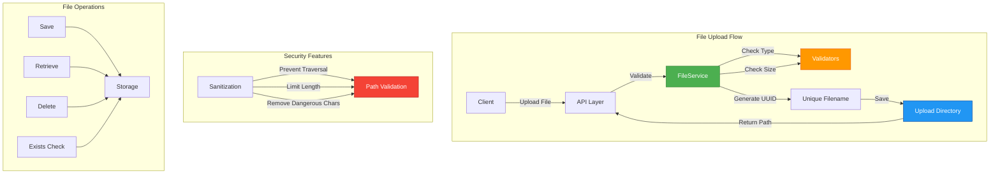

# File Storage Service Documentation

## Overview

The `FileService` provides secure file upload, storage, retrieval, and deletion functionality for resume files in the lead management system. It handles validation, unique filename generation, and protection against common security vulnerabilities like directory traversal attacks.

## Architecture



## FileService Class

### Initialization

```python
from app.services.file_service import FileService

# Service automatically initializes with settings
service = FileService()
```

The service:
- Loads configuration from `Settings`
- Ensures upload directory exists
- Sets up security features

### Configuration

From `app.core.config.Settings`:

```python
UPLOAD_DIR: str = "./uploads/resumes"  # Storage directory
MAX_FILE_SIZE: int = 5242880           # 5MB in bytes
```

## Methods

### 1. save_file()

Saves an uploaded file with validation and unique naming.

**Signature:**
```python
async def save_file(self, file: UploadFile) -> str
```

**Parameters:**
- `file`: FastAPI `UploadFile` object from request

**Returns:**
- `str`: Relative file path (filename only)

**Raises:**
- `HTTPException(400)`: Invalid file type or validation error
- `HTTPException(413)`: File size exceeds limit
- `HTTPException(500)`: File system error

**Example:**
```python
from fastapi import UploadFile

# In endpoint handler
file_service = FileService()
file_path = await file_service.save_file(uploaded_file)
# Returns: "a1b2c3d4-e5f6-7890-abcd-ef1234567890_resume.pdf"
```

**Validation:**
- File type: `.pdf`, `.doc`, `.docx` only
- File size: Maximum 5MB (configurable)
- MIME type verification
- Accurate size check after reading

### 2. get_file_path()

Retrieves the full path to a stored file.

**Signature:**
```python
def get_file_path(self, filename: str) -> Path
```

**Parameters:**
- `filename`: Relative filename from `save_file()`

**Returns:**
- `Path`: Full filesystem path to the file

**Raises:**
- `HTTPException(400)`: Invalid path or traversal attempt
- `HTTPException(404)`: File not found

**Example:**
```python
file_path = file_service.get_file_path("a1b2c3d4-..._resume.pdf")
# Returns: PosixPath('/app/uploads/resumes/a1b2c3d4-..._resume.pdf')
```

### 3. get_file_response()

Creates a FastAPI FileResponse for downloading a file.

**Signature:**
```python
def get_file_response(self, filename: str) -> FileResponse
```

**Parameters:**
- `filename`: Relative filename

**Returns:**
- `FileResponse`: Ready-to-return FastAPI response

**Raises:**
- `HTTPException(400)`: Invalid path
- `HTTPException(404)`: File not found

**Example:**
```python
from fastapi import APIRouter

router = APIRouter()

@router.get("/resumes/{filename}")
async def download_resume(filename: str):
    file_service = FileService()
    return file_service.get_file_response(filename)
```

**Content Types:**
- `.pdf` → `application/pdf`
- `.doc` → `application/msword`
- `.docx` → `application/vnd.openxmlformats-officedocument.wordprocessingml.document`

### 4. delete_file()

Deletes a file from storage.

**Signature:**
```python
def delete_file(self, filename: str) -> bool
```

**Parameters:**
- `filename`: Relative filename

**Returns:**
- `bool`: `True` if deleted, `False` if file didn't exist

**Raises:**
- `HTTPException(400)`: Invalid path
- `HTTPException(500)`: Deletion failed

**Example:**
```python
deleted = file_service.delete_file("a1b2c3d4-..._resume.pdf")
if deleted:
    print("File deleted successfully")
```

### 5. file_exists()

Checks if a file exists in storage.

**Signature:**
```python
def file_exists(self, filename: str) -> bool
```

**Parameters:**
- `filename`: Relative filename

**Returns:**
- `bool`: `True` if exists, `False` otherwise

**Example:**
```python
if file_service.file_exists("resume.pdf"):
    print("File found")
```

**Note:** Returns `False` for invalid paths (no exception raised).

### 6. get_file_size()

Gets the size of a stored file.

**Signature:**
```python
def get_file_size(self, filename: str) -> Optional[int]
```

**Parameters:**
- `filename`: Relative filename

**Returns:**
- `int`: File size in bytes, or `None` if not found

**Example:**
```python
size = file_service.get_file_size("resume.pdf")
if size:
    print(f"File size: {size / (1024*1024):.2f}MB")
```

## Security Features

### 1. Path Sanitization

**Protection Against:**
- Directory traversal (`../../../etc/passwd`)
- Absolute paths (`/etc/passwd`)
- Symlink attacks

**Implementation:**
```python
def _sanitize_file_path(self, file_path: str) -> Path:
    # Resolve to absolute path
    full_path = (self.upload_dir / file_path).resolve()
    
    # Ensure within upload directory
    if not str(full_path).startswith(str(self.upload_dir.resolve())):
        raise ValueError("Invalid file path - directory traversal detected")
    
    return full_path
```

### 2. Unique Filename Generation

**Format:** `{uuid}_{sanitized_name}{extension}`

**Features:**
- UUID prefix prevents collisions
- Sanitizes dangerous characters
- Limits filename length (50 chars)
- Preserves file extension

**Example:**
```python
# Input: "John's Resume (2024).pdf"
# Output: "a1b2c3d4-e5f6-7890-abcd-ef1234567890_JohnsResume2024.pdf"
```

### 3. File Validation

**Type Validation:**
- Allowed extensions: `.pdf`, `.doc`, `.docx`
- MIME type verification
- Extension-based filtering

**Size Validation:**
- Configurable maximum size
- Accurate size check after reading
- Rejects oversized files before processing

### 4. Error Handling

**Consistent HTTP Status Codes:**
- `400 Bad Request`: Invalid input or validation failure
- `404 Not Found`: File doesn't exist
- `413 Request Entity Too Large`: File size exceeded
- `500 Internal Server Error`: File system errors

## Usage Patterns

### Basic File Upload

```python
from fastapi import APIRouter, UploadFile, File
from app.services.file_service import FileService

router = APIRouter()

@router.post("/upload")
async def upload_resume(file: UploadFile = File(...)):
    file_service = FileService()
    
    try:
        file_path = await file_service.save_file(file)
        return {"file_path": file_path, "message": "Upload successful"}
    except HTTPException as e:
        raise e
```

### File Download

```python
@router.get("/download/{filename}")
async def download_resume(filename: str):
    file_service = FileService()
    return file_service.get_file_response(filename)
```

### File Cleanup

```python
@router.delete("/resumes/{filename}")
async def delete_resume(filename: str):
    file_service = FileService()
    
    if file_service.delete_file(filename):
        return {"message": "File deleted successfully"}
    else:
        raise HTTPException(status_code=404, detail="File not found")
```

### Integration with Lead Model

```python
from app.services.file_service import FileService
from app.db.repositories.lead_repository import LeadRepository

async def create_lead_with_resume(
    lead_data: dict,
    resume: UploadFile,
    db: Session
):
    # Save resume
    file_service = FileService()
    resume_path = await file_service.save_file(resume)
    
    # Create lead with resume path
    lead_data["resume_path"] = resume_path
    lead_repo = LeadRepository(db)
    lead = lead_repo.create(lead_data)
    
    return lead
```

## Test Coverage

### Test Suite (`tests/services/test_file_service.py`)

**24 comprehensive tests covering:**

1. **Directory Management (1 test)**
   - Upload directory creation

2. **Filename Generation (4 tests)**
   - Unique naming
   - Extension preservation
   - Character sanitization
   - Length limiting

3. **Path Sanitization (3 tests)**
   - Valid path handling
   - Directory traversal prevention
   - Absolute path rejection

4. **File Upload (4 tests)**
   - Successful upload
   - Unique filename generation
   - Invalid file type rejection
   - File size limit enforcement

5. **File Retrieval (3 tests)**
   - Existing file path retrieval
   - Nonexistent file error
   - Traversal attempt rejection
   - FileResponse generation

6. **File Deletion (3 tests)**
   - Successful deletion
   - Nonexistent file handling
   - Traversal attempt rejection

7. **Utility Methods (3 tests)**
   - File existence checking
   - File size retrieval
   - Traversal handling

### Running Tests

```bash
# Run file service tests only
make unittest tests/services/test_file_service.py

# Run all tests
make unittest

# Run with verbose output
pytest tests/services/test_file_service.py -v
```

### Test Results

```
24 passed in 0.43s
✓ All security features validated
✓ All error cases handled
✓ All async operations tested
```

## Storage Structure

### Directory Layout

```
project_root/
├── uploads/
│   └── resumes/
│       ├── a1b2c3d4-e5f6-7890-abcd-ef1234567890_resume.pdf
│       ├── f1e2d3c4-b5a6-9887-7665-544332211000_johndoe.pdf
│       └── ...
```

### Storage Configuration

**Default Settings:**
- **Directory:** `./uploads/resumes`
- **Maximum Size:** 5MB (5,242,880 bytes)
- **Auto-create:** Yes (directory created if missing)

**Custom Configuration:**
```python
# In .env file
UPLOAD_DIR=/var/www/uploads/resumes
MAX_FILE_SIZE=10485760  # 10MB
```

## Best Practices

### 1. Always Use Async for File Operations

```python
# Good
file_path = await file_service.save_file(file)

# Bad - will not work
file_path = file_service.save_file(file)  # Missing await
```

### 2. Handle Exceptions Properly

```python
from fastapi import HTTPException

try:
    file_path = await file_service.save_file(file)
except HTTPException as e:
    # Log error
    logger.error(f"File upload failed: {e.detail}")
    raise
```

### 3. Clean Up Old Files

```python
# When deleting a lead
if lead.resume_path:
    file_service.delete_file(lead.resume_path)
lead_repo.delete(lead.id)
```

### 4. Validate Before Processing

```python
# Check file exists before operations
if not file_service.file_exists(filename):
    raise HTTPException(status_code=404, detail="File not found")
```

### 5. Use Relative Paths in Database

```python
# Store only filename, not full path
lead.resume_path = "a1b2c3d4-..._resume.pdf"  # Good
lead.resume_path = "/full/path/to/file.pdf"    # Bad
```

## Dependencies

- **FastAPI:** `UploadFile`, `HTTPException`, `FileResponse`
- **Pathlib:** Path manipulation and security
- **UUID:** Unique filename generation
- **Settings:** Configuration management

## Future Enhancements

1. **Cloud Storage Support**
   - S3/Azure Blob integration
   - Abstract storage interface
   - Multi-backend support

2. **Advanced Features**
   - Virus scanning integration
   - File preview generation
   - Compression support
   - Metadata extraction

3. **Performance Optimization**
   - Streaming uploads for large files
   - Chunked upload support
   - Background processing

4. **Additional Security**
   - File content verification
   - Encryption at rest
   - Access control lists

## Related Documentation

- [Validation Rules](./VALIDATION.md) - File validation details
- [Configuration](./ENVIRONMENT_SETUP.md) - Environment configuration
- [Database Models](./DESIGN.md#database-schema) - Lead model integration
