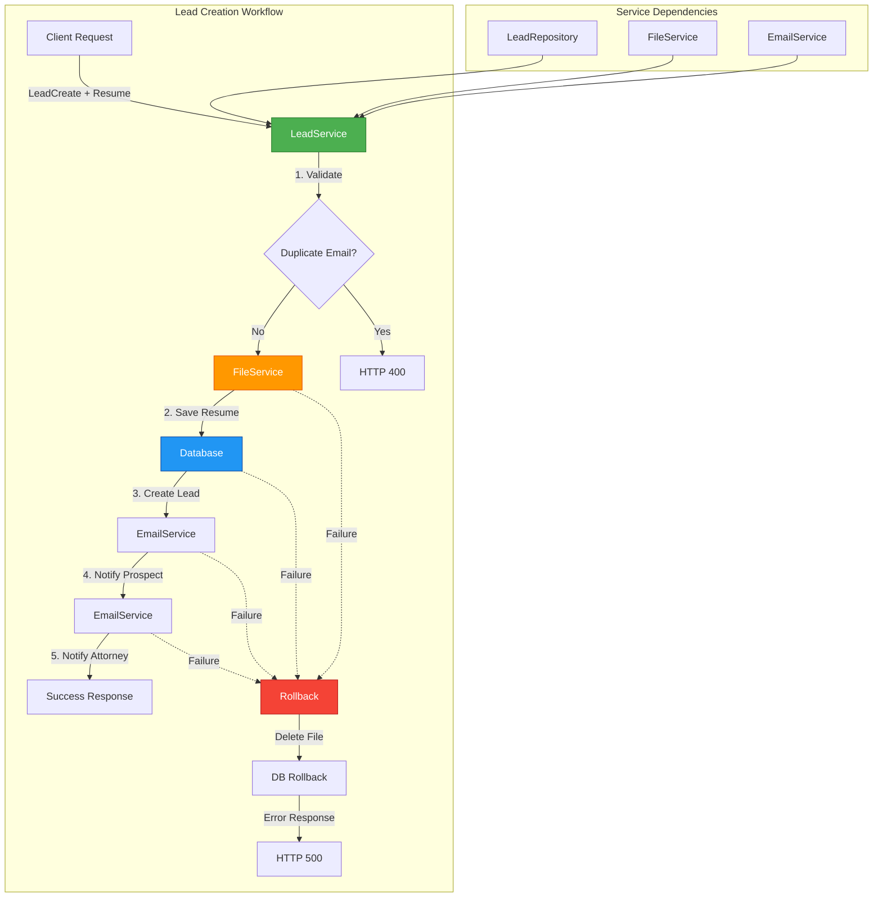

# Lead Service Documentation

## Overview

The `LeadService` is the central orchestrator for lead management workflows. It coordinates file storage, database operations, and email notifications to provide a complete lead lifecycle management system with transaction safety and error handling.

## Architecture



## LeadService Class

### Initialization

```python
from sqlalchemy.orm import Session
from app.services.lead_service import LeadService

# Requires database session
service = LeadService(db=session)
```

The service automatically initializes:
- `LeadRepository` for database operations
- `FileService` for resume management
- `EmailService` for notifications
- `Settings` for configuration

## Core Methods

### 1. create_lead()

Creates a new lead with complete workflow orchestration.

**Workflow Steps:**
1. Validate lead data (automatic via Pydantic)
2. Check for duplicate email
3. Save resume file
4. Create lead in database
5. Send confirmation email to prospect
6. Send notification email to attorney  
7. Automatic rollback on any failure

**Signature:**
```python
async def create_lead(
    self,
    lead_data: LeadCreate,
    resume_file: UploadFile
) -> LeadResponse
```

**Parameters:**
- `lead_data`: Validated lead creation data (first_name, last_name, email)
- `resume_file`: Uploaded resume file (PDF, DOC, or DOCX)

**Returns:**
- `LeadResponse`: Complete lead object with ID, timestamps, and all fields

**Raises:**
- `HTTPException(400)`: Duplicate email exists
- `HTTPException(400)`: Invalid file type or size
- `HTTPException(500)`: File storage, database, or email failure

**Example:**
```python
from fastapi import UploadFile
from app.schemas.lead import LeadCreate

lead_data = LeadCreate(
    first_name="John",
    last_name="Doe",
    email="john.doe@example.com"
)

resume = UploadFile(...)  # From request

lead = await service.create_lead(lead_data, resume)
print(f"Created lead: {lead.id}")
```

**Transaction Safety:**
The method includes comprehensive rollback on failure:
- Uploaded resume file is deleted
- Database transaction is rolled back
- Original error is re-raised or wrapped in HTTP 500

### 2. get_lead()

Retrieves a single lead by ID.

**Signature:**
```python
def get_lead(self, lead_id: UUID) -> LeadResponse
```

**Parameters:**
- `lead_id`: UUID of the lead

**Returns:**
- `LeadResponse`: Lead object with all fields

**Raises:**
- `HTTPException(404)`: Lead not found

**Example:**
```python
from uuid import UUID

lead_id = UUID("a1b2c3d4-e5f6-7890-abcd-ef1234567890")
lead = service.get_lead(lead_id)
print(f"{lead.full_name}: {lead.email}")
```

### 3. get_leads()

Retrieves multiple leads with optional filtering and pagination.

**Signature:**
```python
def get_leads(
    self,
    skip: int = 0,
    limit: int = 100,
    status_filter: Optional[LeadStatus] = None
) -> List[LeadResponse]
```

**Parameters:**
- `skip`: Number of records to skip (offset)
- `limit`: Maximum number of records to return
- `status_filter`: Optional status filter (`LeadStatus.PENDING` or `LeadStatus.REACHED_OUT`)

**Returns:**
- `List[LeadResponse]`: List of lead objects

**Example:**
```python
from app.models.lead import LeadStatus

# Get first 20 pending leads
pending_leads = service.get_leads(
    skip=0,
    limit=20,
    status_filter=LeadStatus.PENDING
)

# Get all leads (paginated)
all_leads = service.get_leads(skip=0, limit=100)
```

### 4. get_leads_paginated()

Retrieves leads with comprehensive pagination metadata.

**Signature:**
```python
def get_leads_paginated(
    self,
    page: int = 1,
    page_size: int = 20,
    status_filter: Optional[LeadStatus] = None
) -> dict
```

**Parameters:**
- `page`: Page number (1-indexed)
- `page_size`: Number of items per page
- `status_filter`: Optional status filter

**Returns:**
Dictionary with:
```python
{
    "leads": [LeadResponse, ...],
    "total": int,              # Total number of leads
    "page": int,               # Current page number
    "page_size": int,          # Items per page
    "total_pages": int,        # Total number of pages
    "has_next": bool,          # Has next page
    "has_previous": bool       # Has previous page
}
```

**Example:**
```python
result = service.get_leads_paginated(page=2, page_size=25)

print(f"Page {result['page']} of {result['total_pages']}")
print(f"Showing {len(result['leads'])} of {result['total']} leads")

if result['has_next']:
    next_page = service.get_leads_paginated(page=result['page'] + 1)
```

### 5. update_lead_status()

Updates lead status with validation and automatic timestamp management.

**Signature:**
```python
def update_lead_status(
    self,
    lead_id: UUID,
    new_status: LeadStatus,
    validate_transition: bool = True
) -> LeadResponse
```

**Parameters:**
- `lead_id`: UUID of the lead
- `new_status`: New status to set
- `validate_transition`: Whether to validate status transition (default: True)

**Returns:**
- `LeadResponse`: Updated lead object

**Raises:**
- `HTTPException(404)`: Lead not found
- `HTTPException(400)`: Invalid status transition

**Status Transitions:**
```
PENDING → REACHED_OUT (allowed)
REACHED_OUT → PENDING (not allowed)
REACHED_OUT → REACHED_OUT (not allowed)
```

**Automatic Behavior:**
- When transitioning to `REACHED_OUT`, `reached_out_at` is automatically set
- `updated_at` is always updated

**Example:**
```python
from app.models.lead import LeadStatus

# Mark lead as reached out
lead = service.update_lead_status(
    lead_id=UUID("a1b2c3d4-..."),
    new_status=LeadStatus.REACHED_OUT
)

print(f"Reached out at: {lead.reached_out_at}")
```

### 6. update_lead()

Updates lead with partial data.

**Signature:**
```python
def update_lead(
    self,
    lead_id: UUID,
    lead_update: LeadUpdate
) -> LeadResponse
```

**Parameters:**
- `lead_id`: UUID of the lead
- `lead_update`: Partial update data (only status supported currently)

**Returns:**
- `LeadResponse`: Updated lead object

**Raises:**
- `HTTPException(404)`: Lead not found
- `HTTPException(400)`: Invalid update data

**Example:**
```python
from app.schemas.lead import LeadUpdate

update_data = LeadUpdate(status=LeadStatus.REACHED_OUT)
lead = service.update_lead(UUID("a1b2c3d4-..."), update_data)
```

### 7. get_recent_leads()

Retrieves most recent leads sorted by creation date.

**Signature:**
```python
def get_recent_leads(self, limit: int = 10) -> List[LeadResponse]
```

**Parameters:**
- `limit`: Maximum number of leads to return (default: 10)

**Returns:**
- `List[LeadResponse]`: List of leads sorted by `created_at` (newest first)

**Example:**
```python
# Get 5 most recent leads
recent = service.get_recent_leads(limit=5)

for lead in recent:
    print(f"{lead.full_name} - {lead.created_at}")
```

### 8. get_lead_count_by_status()

Gets count of leads grouped by status.

**Signature:**
```python
def get_lead_count_by_status(self) -> dict
```

**Returns:**
Dictionary with status as key and count as value:
```python
{
    LeadStatus.PENDING: 15,
    LeadStatus.REACHED_OUT: 8
}
```

**Example:**
```python
counts = service.get_lead_count_by_status()

print(f"Pending: {counts[LeadStatus.PENDING]}")
print(f"Reached Out: {counts[LeadStatus.REACHED_OUT]}")
print(f"Total: {sum(counts.values())}")
```

### 9. delete_lead()

Deletes a lead and its associated resume file.

**Signature:**
```python
def delete_lead(self, lead_id: UUID) -> bool
```

**Parameters:**
- `lead_id`: UUID of the lead

**Returns:**
- `bool`: `True` if lead was deleted

**Raises:**
- `HTTPException(404)`: Lead not found

**Behavior:**
- Deletes resume file (if exists)
- Deletes lead from database
- File deletion errors are logged but don't prevent lead deletion

**Example:**
```python
service.delete_lead(UUID("a1b2c3d4-..."))
print("Lead deleted successfully")
```

## Usage Patterns

### Complete Lead Creation Flow

```python
from fastapi import APIRouter, UploadFile, File, Form
from sqlalchemy.orm import Session
from app.services.lead_service import LeadService
from app.schemas.lead import LeadCreate

router = APIRouter()

@router.post("/leads")
async def create_lead(
    first_name: str = Form(...),
    last_name: str = Form(...),
    email: str = Form(...),
    resume: UploadFile = File(...),
    db: Session = Depends(get_db)
):
    """Create a new lead with resume upload."""
    
    # Create lead data
    lead_data = LeadCreate(
        first_name=first_name,
        last_name=last_name,
        email=email
    )
    
    # Initialize service
    lead_service = LeadService(db)
    
    try:
        # Create lead (handles file, db, emails automatically)
        lead = await lead_service.create_lead(lead_data, resume)
        
        return {
            "message": "Lead created successfully",
            "lead_id": str(lead.id),
            "status": lead.status
        }
    
    except HTTPException as e:
        raise e
    except Exception as e:
        raise HTTPException(
            status_code=500,
            detail=f"Failed to create lead: {str(e)}"
        )
```

### List Leads with Pagination

```python
@router.get("/leads")
def list_leads(
    page: int = Query(1, ge=1),
    page_size: int = Query(20, ge=1, le=100),
    status: Optional[LeadStatus] = Query(None),
    db: Session = Depends(get_db)
):
    """List leads with pagination and filtering."""
    
    lead_service = LeadService(db)
    
    result = lead_service.get_leads_paginated(
        page=page,
        page_size=page_size,
        status_filter=status
    )
    
    return result
```

### Update Lead Status

```python
@router.patch("/leads/{lead_id}/status")
def update_lead_status(
    lead_id: UUID,
    new_status: LeadStatus,
    db: Session = Depends(get_db),
    current_user: User = Depends(get_current_active_user)
):
    """Update lead status (attorney only)."""
    
    lead_service = LeadService(db)
    
    lead = lead_service.update_lead_status(
        lead_id=lead_id,
        new_status=new_status
    )
    
    return {
        "message": "Status updated successfully",
        "lead": lead
    }
```

### Dashboard Statistics

```python
@router.get("/dashboard/stats")
def get_dashboard_stats(db: Session = Depends(get_db)):
    """Get dashboard statistics."""
    
    lead_service = LeadService(db)
    
    counts = lead_service.get_lead_count_by_status()
    recent = lead_service.get_recent_leads(limit=10)
    
    return {
        "total_leads": sum(counts.values()),
        "pending_leads": counts[LeadStatus.PENDING],
        "reached_out_leads": counts[LeadStatus.REACHED_OUT],
        "recent_leads": recent
    }
```

## Business Logic

### Duplicate Email Prevention

```python
# Automatic duplicate checking
existing_lead = lead_repo.get_by_email(lead_data.email)
if existing_lead:
    raise HTTPException(
        status_code=400,
        detail=f"A lead with email {lead_data.email} already exists"
    )
```

### Status Transition Validation

```python
# Only PENDING → REACHED_OUT is allowed
allowed_transitions = {
    LeadStatus.PENDING.value: [LeadStatus.REACHED_OUT.value],
    LeadStatus.REACHED_OUT.value: []  # Terminal state
}

validate_status_transition(
    current_status=lead.status.value,
    new_status=new_status.value,
    allowed_transitions=allowed_transitions
)
```

### Automatic Timestamp Management

- `reached_out_at` is set automatically when status changes to `REACHED_OUT`
- `updated_at` is updated on any modification
- Handled by `LeadRepository.update_status()`

## Error Handling

### Rollback on Failure

The `create_lead` method implements comprehensive rollback:

```python
try:
    # ... workflow steps ...
except HTTPException:
    _rollback_lead_creation(resume_path, lead)
    raise
except Exception as e:
    _rollback_lead_creation(resume_path, lead)
    raise HTTPException(status_code=500, detail=str(e))
```

**Rollback actions:**
1. Database transaction rollback
2. Uploaded file deletion
3. Silent failure handling for file cleanup

### HTTP Exception Codes

- **400 Bad Request**:
  - Duplicate email
  - Invalid file type/size
  - Invalid status transition
  
- **404 Not Found**:
  - Lead not found
  
- **500 Internal Server Error**:
  - File storage failure
  - Database error
  - Email sending failure

## Test Coverage

### Test Suite (`tests/services/test_lead_service.py`)

**18 comprehensive tests covering:**

1. **Lead Creation (3 tests)**
   - Successful creation with full workflow
   - Duplicate email prevention
   - Rollback on email failure

2. **Lead Retrieval (5 tests)**
   - Get single lead
   - Get multiple leads
   - Filtering by status
   - Pagination with metadata
   - Pagination edge cases

3. **Lead Updates (4 tests)**
   - Status update success
   - Invalid status transition
   - Lead not found
   - Update with status

4. **Utility Methods (3 tests)**
   - Get recent leads
   - Get count by status
   - Lead deletion

5. **Edge Cases (3 tests)**
   - Delete non-existent lead
   - Delete without resume
   - Various pagination scenarios

### Running Tests

```bash
# Run lead service tests only
pytest tests/services/test_lead_service.py -v

# Run all service tests
pytest tests/services/ -v

# Run with coverage
pytest tests/services/test_lead_service.py --cov=app.services.lead_service
```

### Test Results

```
18 passed in 0.45s
✓ All workflow steps validated
✓ All error cases handled
✓ Rollback logic verified
✓ Integration with all services tested
```

## Integration

### Service Dependencies

```python
class LeadService:
    def __init__(self, db: Session):
        self.db = db
        self.lead_repo = LeadRepository(db)         # Database operations
        self.file_service = FileService()           # File management
        self.email_service = EmailService()         # Email notifications
        self.settings = get_settings()              # Configuration
```

### Repository Pattern

The service uses `LeadRepository` for all database operations:
- `get_by_email()` - Check duplicates
- `create()` - Insert new lead
- `get()` - Retrieve by ID
- `get_multi()` - List leads
- `get_by_status()` - Filter by status
- `update_status()` - Update with timestamp management
- `delete()` - Remove lead

### File Storage Integration

```python
# Save resume
resume_path = await file_service.save_file(resume_file)

# Rollback: delete file
file_service.delete_file(resume_path)
```

### Email Notification Integration

```python
# Notify prospect
await email_service.send_prospect_confirmation(
    prospect_email=lead.email,
    prospect_name=f"{lead.first_name} {lead.last_name}",
    lead_id=str(lead.id)
)

# Notify attorney
await email_service.send_attorney_notification(
    lead_id=str(lead.id),
    prospect_name=f"{lead.first_name} {lead.last_name}",
    prospect_email=lead.email,
    resume_filename=resume_path
)
```

## Best Practices

### 1. Always Use Database Session

```python
# Good - pass session to service
service = LeadService(db)

# Bad - don't create service without session
service = LeadService()  # Will fail
```

### 2. Handle Async Operations

```python
# Good - await async methods
lead = await service.create_lead(lead_data, resume)

# Bad - missing await
lead = service.create_lead(lead_data, resume)  # Won't work
```

### 3. Commit Transactions

```python
# Service handles commits internally
lead = await service.create_lead(lead_data, resume)
# No need to call db.commit() - already done

# For custom workflows
try:
    lead = await service.create_lead(lead_data, resume)
    # Additional operations...
    db.commit()
except:
    db.rollback()
    raise
```

### 4. Error Handling

```python
try:
    lead = await service.create_lead(lead_data, resume)
except HTTPException as e:
    # Re-raise HTTP exceptions
    raise e
except Exception as e:
    # Log unexpected errors
    logger.error(f"Lead creation failed: {str(e)}")
    raise HTTPException(status_code=500, detail="Internal error")
```

### 5. Pagination

```python
# Use paginated method for UI
result = service.get_leads_paginated(page=1, page_size=20)

# Use get_leads for programmatic access
all_leads = service.get_leads(skip=0, limit=1000)
```

## Performance Considerations

### Database Queries

- Uses repository pattern with optimized queries
- Supports offset-based pagination
- Indexed columns: `email`, `status`, `created_at`

### File Operations

- Async file upload for non-blocking I/O
- Automatic cleanup on failure
- UUID-based filenames prevent collisions

### Email Sending

- Async email sending for non-blocking I/O
- Automatic retry logic (3 attempts)
- Doesn't block lead creation response

## Future Enhancements

1. **Batch Operations**
   - Bulk lead import
   - Batch status updates
   - Bulk email sending

2. **Advanced Filtering**
   - Date range filters
   - Full-text search
   - Multiple status filters

3. **Lead Assignment**
   - Assign leads to specific attorneys
   - Load balancing
   - Priority queuing

4. **Audit Trail**
   - Track all status changes
   - Record who made changes
   - History log

5. **Analytics**
   - Conversion tracking
   - Response time metrics
   - Attorney performance

## Related Documentation

- [Authentication Service](./AUTHENTICATION.md) - User management and security
- [File Storage Service](./FILE_STORAGE.md) - Resume file handling
- [Email Service](./EMAIL_SERVICE.md) - Notification system
- [Repository Pattern](./REPOSITORY_PATTERN.md) - Data access layer
- [Database Models](./DESIGN.md#database-schema) - Lead model structure
