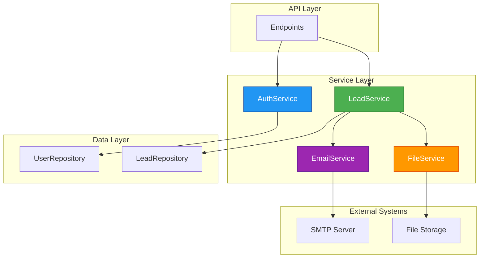

# Services Documentation

**Version:** 1.0.0  
**Last Updated:** December 2025

---

## Table of Contents

1. [Overview](#overview)
2. [Authentication Service](#authentication-service)
3. [File Storage Service](#file-storage-service)
4. [Email Service](#email-service)
5. [Lead Service](#lead-service)
6. [Integration Patterns](#integration-patterns)

---

## Overview

The services layer implements the business logic for the Lead Management API. Each service encapsulates a specific domain functionality and coordinates between repositories, external systems, and other services.

### Service Architecture



### Key Principles

- **Single Responsibility**: Each service handles one domain
- **Separation of Concerns**: Business logic separated from data access
- **Transaction Management**: Services handle database commits and rollbacks
- **Error Handling**: Consistent HTTP exception patterns
- **Async Support**: Non-blocking I/O for file and email operations

---

## Authentication Service

### Overview

Complete authentication system with password hashing (bcrypt), JWT token management, and FastAPI security dependencies for protected routes.

### Files

- **Security Module**: `app/core/security.py` (240 lines)
- **Service Module**: `app/services/auth_service.py` (177 lines)

### Security Functions

#### Password Hashing

**`hash_password(password: str) -> str`**

Hash a password using bcrypt with automatic salt generation.

```python
from app.core.security import hash_password

hashed = hash_password("SecurePassword123")
# Returns: "$2b$12$..." (60 characters, bcrypt format)
```

**Features:**
- Bcrypt algorithm (industry standard)
- Automatic salt generation
- Truncates to 72 chars (bcrypt limit)
- Work factor: 12 rounds

**`verify_password(plain_password: str, hashed_password: str) -> bool`**

Verify a password against a bcrypt hash.

```python
from app.core.security import verify_password, hash_password

hashed = hash_password("SecurePassword123")

verify_password("SecurePassword123", hashed)  # True
verify_password("WrongPassword", hashed)      # False
```

**Features:**
- Constant-time comparison (timing attack resistant)
- Case-sensitive validation

#### JWT Token Management

**`create_access_token(data: dict, expires_delta: Optional[timedelta] = None) -> str`**

Create a JWT access token with claims.

```python
from app.core.security import create_access_token
from datetime import timedelta

# Default expiration (from config)
token = create_access_token({"sub": "attorney1"})

# Custom expiration
token = create_access_token(
    {"sub": "attorney1"},
    expires_delta=timedelta(hours=24)
)
```

**Token Payload:**
```json
{
  "sub": "attorney1",
  "exp": 1702567890
}
```

**`verify_token(token: str) -> TokenData`**

Verify and decode a JWT token.

```python
from app.core.security import verify_token

try:
    token_data = verify_token(token_string)
    print(f"Username: {token_data.username}")
except HTTPException:
    print("Invalid token")
```

#### FastAPI Dependencies

**`get_current_user(token: str, db: Session) -> User`**

FastAPI dependency to extract and validate current user from JWT.

```python
from fastapi import Depends
from app.core.security import get_current_user
from app.models.user import User

@app.get("/protected")
async def protected_route(current_user: User = Depends(get_current_user)):
    return {"username": current_user.username}
```

**Process:**
1. Extract token from `Authorization: Bearer <token>` header
2. Verify token signature and expiration
3. Extract username from token
4. Look up user in database
5. Return User object

**`get_current_active_user(current_user: User) -> User`**

Ensures user is active.

```python
@app.get("/protected")
async def protected_route(user: User = Depends(get_current_active_user)):
    return {"username": user.username}
```

**`authenticate_user(username: str, password: str, db: Session) -> Optional[User]`**

Authenticate user by credentials.

```python
from app.core.security import authenticate_user

user = authenticate_user("attorney1", "Password123", db)
if user:
    print("Authenticated!")
else:
    print("Invalid credentials")
```

### AuthService Class

Business logic layer for authentication operations.

#### Initialization

```python
from app.services import AuthService
from sqlalchemy.orm import Session

service = AuthService(db_session)
```

#### Methods

**`register_user(user_data: UserCreate) -> User`**

Register a new attorney user.

```python
from app.schemas.user import UserCreate

user_data = UserCreate(
    username="attorney1",
    email="attorney@lawfirm.com",
    password="SecurePass123"
)

user = service.register_user(user_data)
```

**Validation:**
- Username not already taken
- Email not already registered
- Password automatically hashed
- Default is_active = True

**Raises:**
- `HTTPException(400)` if username exists
- `HTTPException(400)` if email exists

**`login(username: str, password: str) -> Token`**

Authenticate and generate token.

```python
token = service.login("attorney1", "SecurePass123")

print(token.access_token)  # JWT token string
print(token.token_type)    # "bearer"
```

**`get_user_by_username(username: str) -> Optional[User]`**

Look up user by username.

```python
user = service.get_user_by_username("attorney1")
if user:
    print(user.email)
```

**`check_user_permissions(user: User, permission: str) -> bool`**

Check if user has a specific permission.

```python
has_access = service.check_user_permissions(user, "view_leads")
```

**Note:** Currently all active users have all permissions. Future implementation will add role-based access control (RBAC).

**`deactivate_user(user_id: UUID) -> User`**  
**`activate_user(user_id: UUID) -> User`**

Manage user account status.

```python
# Deactivate
service.deactivate_user(user.id)

# Activate
service.activate_user(user.id)
```

### Security Features

**Password Security:**
- Bcrypt hashing with 12 rounds
- Automatic salt generation
- Rainbow table resistant
- Minimum 8 characters requirement

**JWT Security:**
- Signed with SECRET_KEY (32+ chars)
- HS256 algorithm
- Expiration timestamp
- Cannot be tampered with

**Protection Against Attacks:**
- Timing attacks (constant-time comparison)
- Brute force (bcrypt work factor)
- Token tampering (HMAC signature)

### Configuration

```bash
# .env file
SECRET_KEY=your-secret-key-min-32-characters-long
ALGORITHM=HS256
ACCESS_TOKEN_EXPIRE_MINUTES=1440
```

---

## File Storage Service

### Overview

Secure file upload, storage, retrieval, and deletion functionality for resume files with validation and protection against security vulnerabilities.

### FileService Class

#### Initialization

```python
from app.services.file_service import FileService

service = FileService()
```

The service automatically:
- Loads configuration from Settings
- Ensures upload directory exists
- Sets up security features

#### Configuration

```python
UPLOAD_DIR: str = "./uploads/resumes"
MAX_FILE_SIZE: int = 5242880  # 5MB
```

### Methods

**`async save_file(file: UploadFile) -> str`**

Saves an uploaded file with validation and unique naming.

```python
from fastapi import UploadFile

file_service = FileService()
file_path = await file_service.save_file(uploaded_file)
# Returns: "a1b2c3d4-e5f6-7890-abcd-ef1234567890_resume.pdf"
```

**Parameters:**
- `file`: FastAPI UploadFile object

**Returns:**
- Relative file path (filename only)

**Raises:**
- `HTTPException(400)`: Invalid file type
- `HTTPException(413)`: File too large
- `HTTPException(500)`: File system error

**Validation:**
- File type: `.pdf`, `.doc`, `.docx` only
- File size: Maximum 5MB
- MIME type verification

**`get_file_path(filename: str) -> Path`**

Retrieves the full path to a stored file.

```python
file_path = file_service.get_file_path("a1b2c3d4-..._resume.pdf")
# Returns: PosixPath('/app/uploads/resumes/a1b2c3d4-..._resume.pdf')
```

**Raises:**
- `HTTPException(400)`: Invalid path or traversal attempt
- `HTTPException(404)`: File not found

**`get_file_response(filename: str) -> FileResponse`**

Creates a FastAPI FileResponse for downloading.

```python
@router.get("/resumes/{filename}")
async def download_resume(filename: str):
    file_service = FileService()
    return file_service.get_file_response(filename)
```

**Content Types:**
- `.pdf` → `application/pdf`
- `.doc` → `application/msword`
- `.docx` → `application/vnd.openxmlformats-officedocument.wordprocessingml.document`

**`delete_file(filename: str) -> bool`**

Deletes a file from storage.

```python
deleted = file_service.delete_file("a1b2c3d4-..._resume.pdf")
if deleted:
    print("File deleted successfully")
```

**`file_exists(filename: str) -> bool`**

Checks if a file exists.

```python
if file_service.file_exists("resume.pdf"):
    print("File found")
```

**`get_file_size(filename: str) -> Optional[int]`**

Gets the size of a stored file in bytes.

```python
size = file_service.get_file_size("resume.pdf")
if size:
    print(f"File size: {size / (1024*1024):.2f}MB")
```

### Security Features

**Path Sanitization:**
- Protection against directory traversal (`../../../etc/passwd`)
- Absolute path rejection
- Symlink attack prevention

**Unique Filename Generation:**
- Format: `{uuid}_{sanitized_name}{extension}`
- Example: `a1b2c3d4-e5f6-7890-abcd-ef1234567890_JohnsResume.pdf`
- Features:
  - UUID prefix prevents collisions
  - Sanitizes dangerous characters
  - Limits filename length (50 chars)
  - Preserves file extension

**File Validation:**
- Allowed extensions only
- MIME type verification
- Accurate size checking
- Rejects oversized files before processing

### Storage Structure

```
project_root/
├── uploads/
│   └── resumes/
│       ├── a1b2c3d4-e5f6-7890-abcd-ef1234567890_resume.pdf
│       ├── f1e2d3c4-b5a6-9887-7665-544332211000_johndoe.pdf
│       └── ...
```

---

## Email Service

### Overview

Email notification functionality with template rendering, SMTP integration, and automatic retry logic.

### EmailService Class

#### Initialization

```python
from app.services.email_service import EmailService

service = EmailService()
```

The service automatically:
- Loads SMTP configuration
- Initializes Jinja2 template engine
- Sets up template directory path

#### Configuration

```python
SMTP_HOST: str
SMTP_PORT: int = 587
SMTP_USERNAME: str
SMTP_PASSWORD: str
SMTP_FROM_EMAIL: EmailStr
SMTP_FROM_NAME: str
ATTORNEY_EMAIL: EmailStr
```

### Methods

**`async send_prospect_confirmation(prospect_email: str, prospect_name: str, lead_id: str) -> bool`**

Sends confirmation email to prospect after lead submission.

```python
email_service = EmailService()

await email_service.send_prospect_confirmation(
    prospect_email="john.doe@example.com",
    prospect_name="John Doe",
    lead_id="a1b2c3d4-e5f6-7890-abcd-ef1234567890"
)
```

**Email Contents:**
- Professional HTML template
- Submission confirmation
- Reference number (lead ID)
- Next steps information
- Timeline expectations

**`async send_attorney_notification(lead_id: str, prospect_name: str, prospect_email: str, resume_filename: str, dashboard_url: Optional[str] = None) -> bool`**

Sends notification to attorney about new lead.

```python
await email_service.send_attorney_notification(
    lead_id="a1b2c3d4-e5f6-7890-abcd-ef1234567890",
    prospect_name="John Doe",
    prospect_email="john.doe@example.com",
    resume_filename="a1b2c3d4-..._resume.pdf",
    dashboard_url="https://dashboard.example.com/leads/a1b2c3d4-..."
)
```

**Email Contents:**
- Alert badge for new lead
- Lead details summary
- Direct link to dashboard
- Action required notice
- Lead status indicator

**`async send_custom_email(to_email: str, subject: str, html_content: str, max_retries: int = 3) -> bool`**

Sends custom HTML email.

```python
html = """
<html>
<body>
    <h1>Custom Email</h1>
    <p>This is a custom message.</p>
</body>
</html>
"""

await email_service.send_custom_email(
    to_email="recipient@example.com",
    subject="Custom Notification",
    html_content=html,
    max_retries=5
)
```

### Email Templates

Templates are stored in `app/templates/`:

**prospect_confirmation.html:**
- Variables: `{{ prospect_name }}`, `{{ lead_id }}`, `{{ company_name }}`
- Professional styling with responsive design
- Clear submission confirmation
- Reference number display
- Next steps section

**attorney_notification.html:**
- Variables: `{{ lead_id }}`, `{{ prospect_name }}`, `{{ prospect_email }}`, `{{ resume_filename }}`, `{{ dashboard_url }}`
- Attention-grabbing design with "NEW LEAD" badge
- Structured lead details
- Action button to dashboard
- Status indicator

### Features

**Template Rendering:**
- Jinja2 integration
- Automatic HTML escaping for security
- Variable substitution
- Error handling

**SMTP Connection:**
- TLS encryption via STARTTLS
- Username/password authentication
- Configurable host and port
- Connection pooling via async

**Retry Logic:**
- Default: 3 attempts
- Configurable per method
- Exponential backoff delay
- Detailed error messages

**Error Handling:**
- `HTTPException(500)`: Template rendering failed
- `HTTPException(500)`: Email sending failed after retries
- Clear error messages with context

### Security

**Credential Protection:**
```bash
# .env file (never committed)
SMTP_HOST=smtp.example.com
SMTP_USERNAME=user@example.com
SMTP_PASSWORD=secret_password
SMTP_FROM_EMAIL=noreply@example.com
ATTORNEY_EMAIL=attorney@example.com
```

**Template Security:**
- Jinja2 auto-escaping enabled (XSS prevention)
- Safe variable substitution
- Email validation via Pydantic

---

## Lead Service

### Overview

Central orchestrator for lead management workflows, coordinating file storage, database operations, and email notifications with transaction safety.

### LeadService Class

#### Initialization

```python
from sqlalchemy.orm import Session
from app.services.lead_service import LeadService

service = LeadService(db=session)
```

The service automatically initializes:
- LeadRepository for database operations
- FileService for resume management
- EmailService for notifications
- Settings for configuration

### Core Methods

**`async create_lead(lead_data: LeadCreate, resume_file: UploadFile) -> LeadResponse`**

Creates a new lead with complete workflow orchestration.

**Workflow Steps:**
1. Validate lead data (automatic via Pydantic)
2. Check for duplicate email
3. Save resume file
4. Create lead in database
5. Send confirmation email to prospect
6. Send notification email to attorney
7. Automatic rollback on any failure

```python
from fastapi import UploadFile
from app.schemas.lead import LeadCreate

lead_data = LeadCreate(
    first_name="John",
    last_name="Doe",
    email="john.doe@example.com"
)

resume = UploadFile(...)  # From request

lead = await service.create_lead(lead_data, resume)
print(f"Created lead: {lead.id}")
```

**Transaction Safety:**
- Uploaded resume file deleted on failure
- Database transaction rolled back
- Original error re-raised or wrapped in HTTP 500

**Raises:**
- `HTTPException(400)`: Duplicate email
- `HTTPException(400)`: Invalid file
- `HTTPException(500)`: File/database/email failure

**`get_lead(lead_id: UUID) -> LeadResponse`**

Retrieves a single lead by ID.

```python
from uuid import UUID

lead_id = UUID("a1b2c3d4-e5f6-7890-abcd-ef1234567890")
lead = service.get_lead(lead_id)
print(f"{lead.full_name}: {lead.email}")
```

**`get_leads(skip: int = 0, limit: int = 100, status_filter: Optional[LeadStatus] = None) -> List[LeadResponse]`**

Retrieves multiple leads with optional filtering.

```python
from app.models.lead import LeadStatus

# Get first 20 pending leads
pending_leads = service.get_leads(
    skip=0,
    limit=20,
    status_filter=LeadStatus.PENDING
)
```

**`get_leads_paginated(page: int = 1, page_size: int = 20, status_filter: Optional[LeadStatus] = None) -> dict`**

Retrieves leads with pagination metadata.

```python
result = service.get_leads_paginated(page=2, page_size=25)

print(f"Page {result['page']} of {result['total_pages']}")
print(f"Showing {len(result['leads'])} of {result['total']} leads")

if result['has_next']:
    next_page = service.get_leads_paginated(page=result['page'] + 1)
```

**Returns:**
```python
{
    "leads": [LeadResponse, ...],
    "total": int,
    "page": int,
    "page_size": int,
    "total_pages": int,
    "has_next": bool,
    "has_previous": bool
}
```

**`update_lead_status(lead_id: UUID, new_status: LeadStatus, validate_transition: bool = True) -> LeadResponse`**

Updates lead status with validation.

```python
from app.models.lead import LeadStatus

lead = service.update_lead_status(
    lead_id=UUID("a1b2c3d4-..."),
    new_status=LeadStatus.REACHED_OUT
)

print(f"Reached out at: {lead.reached_out_at}")
```

**Status Transitions:**
- `PENDING` → `REACHED_OUT` (allowed)
- `REACHED_OUT` → `PENDING` (allowed - can revert)

**Automatic Behavior:**
- When transitioning to `REACHED_OUT`, `reached_out_at` is set
- `updated_at` is always updated

**`update_lead(lead_id: UUID, lead_update: LeadUpdate) -> LeadResponse`**

Updates lead with partial data.

```python
from app.schemas.lead import LeadUpdate

update_data = LeadUpdate(status=LeadStatus.REACHED_OUT)
lead = service.update_lead(UUID("a1b2c3d4-..."), update_data)
```

**`get_recent_leads(limit: int = 10) -> List[LeadResponse]`**

Retrieves most recent leads.

```python
recent = service.get_recent_leads(limit=5)

for lead in recent:
    print(f"{lead.full_name} - {lead.created_at}")
```

**`get_lead_count_by_status() -> dict`**

Gets count of leads grouped by status.

```python
counts = service.get_lead_count_by_status()

print(f"Pending: {counts[LeadStatus.PENDING]}")
print(f"Reached Out: {counts[LeadStatus.REACHED_OUT]}")
print(f"Total: {sum(counts.values())}")
```

**`delete_lead(lead_id: UUID) -> bool`**

Deletes a lead and its resume file.

```python
service.delete_lead(UUID("a1b2c3d4-..."))
print("Lead deleted successfully")
```

### Business Logic

**Duplicate Email Prevention:**
```python
existing_lead = lead_repo.get_by_email(lead_data.email)
if existing_lead:
    raise HTTPException(
        status_code=400,
        detail=f"A lead with email {lead_data.email} already exists"
    )
```

**Status Transition Validation:**
```python
allowed_transitions = {
    LeadStatus.PENDING.value: [LeadStatus.REACHED_OUT.value],
    LeadStatus.REACHED_OUT.value: [LeadStatus.PENDING.value]
}
```

**Automatic Timestamp Management:**
- `reached_out_at` set when status changes to `REACHED_OUT`
- `updated_at` updated on any modification
- Handled by `LeadRepository.update_status()`

### Error Handling

**Rollback on Failure:**
```python
try:
    # ... workflow steps ...
except HTTPException:
    _rollback_lead_creation(resume_path, lead)
    raise
except Exception as e:
    _rollback_lead_creation(resume_path, lead)
    raise HTTPException(status_code=500, detail=str(e))
```

**Rollback Actions:**
1. Database transaction rollback
2. Uploaded file deletion
3. Silent failure handling for file cleanup

---

## Integration Patterns

### Complete Lead Creation Flow

```python
from fastapi import APIRouter, UploadFile, File, Form, Depends
from sqlalchemy.orm import Session
from app.services.lead_service import LeadService
from app.schemas.lead import LeadCreate
from app.db.database import get_db

router = APIRouter()

@router.post("/leads")
async def create_lead(
    first_name: str = Form(...),
    last_name: str = Form(...),
    email: str = Form(...),
    resume: UploadFile = File(...),
    db: Session = Depends(get_db)
):
    """Create a new lead with resume upload."""
    
    lead_data = LeadCreate(
        first_name=first_name,
        last_name=last_name,
        email=email
    )
    
    lead_service = LeadService(db)
    
    try:
        lead = await lead_service.create_lead(lead_data, resume)
        
        return {
            "message": "Lead created successfully",
            "lead_id": str(lead.id),
            "status": lead.status
        }
    
    except HTTPException as e:
        raise e
    except Exception as e:
        raise HTTPException(
            status_code=500,
            detail=f"Failed to create lead: {str(e)}"
        )
```

### Authentication Flow

```python
from fastapi import FastAPI, Depends, HTTPException
from fastapi.security import OAuth2PasswordRequestForm
from sqlalchemy.orm import Session
from app.services import AuthService
from app.schemas.user import UserCreate, UserResponse, Token
from app.core.security import get_current_active_user
from app.db.database import get_db
from app.models.user import User

app = FastAPI()

@app.post("/api/auth/register", response_model=UserResponse, status_code=201)
def register(user_data: UserCreate, db: Session = Depends(get_db)):
    service = AuthService(db)
    return service.register_user(user_data)

@app.post("/api/auth/login", response_model=Token)
def login(
    form_data: OAuth2PasswordRequestForm = Depends(),
    db: Session = Depends(get_db)
):
    service = AuthService(db)
    return service.login(form_data.username, form_data.password)

@app.get("/api/auth/me", response_model=UserResponse)
async def get_me(current_user: User = Depends(get_current_active_user)):
    return current_user

@app.get("/api/leads")
async def list_leads(current_user: User = Depends(get_current_active_user)):
    return {"message": f"Welcome, {current_user.username}"}
```

### Service Coordination Example

```python
from app.services.email_service import EmailService
from app.services.file_service import FileService
from app.db.repositories.lead_repository import LeadRepository

async def create_lead_with_notifications(
    lead_data: dict,
    resume: UploadFile,
    db: Session
):
    file_service = FileService()
    email_service = EmailService()
    lead_repo = LeadRepository(db)
    
    resume_path = None
    lead = None
    
    try:
        # Save resume
        resume_path = await file_service.save_file(resume)
        lead_data["resume_path"] = resume_path
        
        # Create lead
        lead = lead_repo.create(lead_data)
        db.commit()
        
        # Send emails
        await email_service.send_prospect_confirmation(
            prospect_email=lead.email,
            prospect_name=f"{lead.first_name} {lead.last_name}",
            lead_id=str(lead.id)
        )
        
        await email_service.send_attorney_notification(
            lead_id=str(lead.id),
            prospect_name=f"{lead.first_name} {lead.last_name}",
            prospect_email=lead.email,
            resume_filename=resume_path
        )
        
        return lead
        
    except Exception as e:
        db.rollback()
        
        if resume_path:
            file_service.delete_file(resume_path)
        
        raise HTTPException(
            status_code=500,
            detail=f"Failed to create lead: {str(e)}"
        )
```

## Best Practices

### 1. Service Initialization

```python
# Good - pass required dependencies
auth_service = AuthService(db)
lead_service = LeadService(db)
file_service = FileService()  # Uses settings
email_service = EmailService()  # Uses settings

# Bad - missing dependencies
lead_service = LeadService()  # Will fail - needs db
```

### 2. Async Operations

```python
# Good - await async methods
file_path = await file_service.save_file(file)
await email_service.send_prospect_confirmation(...)

# Bad - missing await
file_path = file_service.save_file(file)  # Won't work
```

### 3. Transaction Management

```python
# Service handles commits internally
lead = await lead_service.create_lead(lead_data, resume)
# No need to call db.commit() - already done

# For custom workflows
try:
    lead = await lead_service.create_lead(lead_data, resume)
    # Additional operations...
    db.commit()
except:
    db.rollback()
    raise
```

### 4. Error Handling

```python
try:
    result = await service.method(...)
except HTTPException as e:
    # Re-raise HTTP exceptions
    raise e
except Exception as e:
    # Log unexpected errors
    logger.error(f"Operation failed: {str(e)}")
    raise HTTPException(status_code=500, detail="Internal error")
```

### 5. Resource Cleanup

```python
# Always clean up on failure
try:
    file_path = await file_service.save_file(file)
    # ... process file ...
except:
    # Clean up uploaded file
    if file_path:
        file_service.delete_file(file_path)
    raise
```

---

## Performance Considerations

### Async I/O

- File operations are async (non-blocking)
- Email sending is async
- Multiple operations can run concurrently

### Database Optimization

- Repository pattern with optimized queries
- Offset-based pagination
- Indexed columns for filtering and sorting

### Caching Strategies

Consider caching for:
- User authentication results
- Lead counts by status
- Recent leads list
- Configuration settings

---

## Related Documentation

- [API Documentation](./API.md) - API endpoint reference
- [Database Documentation](./DATABASE.md) - Database models and repositories
- [Schema Documentation](./SCHEMA.md) - Data validation schemas
- [Design Documentation](./DESIGN.md) - Architecture and design decisions

---

**Services Version:** 1.0.0  
**Last Updated:** December 2025  
**Test Coverage:** 82+ tests across all services
